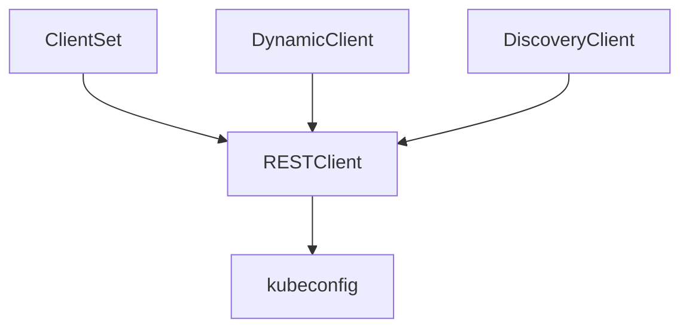

# client-go source structure

- [client-go source structure](#client-go-source-structure)
  - [kubernetes的client-go目录结构](#kubernetes的client-go目录结构)
    - [目录结构](#目录结构)
    - [目录结构分类](#目录结构分类)
  - [Client 对象](#client-对象)
    - [不同的Client对象特性](#不同的client对象特性)
    - [RESTClient客户端](#restclient客户端)
    - [ClientSet客户端](#clientset客户端)


## kubernetes的client-go目录结构

### 目录结构
v1.18.3版本client-go目录结构如下
```
client-go
├── BUILD
├── CONTRIBUTING.md
├── Godeps
├── INSTALL.md
├── LICENSE
├── OWNERS
├── SECURITY_CONTACTS
├── code-of-conduct.md
├── deprecated
├── discovery
├── dynamic
├── examples
├── go.mod
├── go.sum
├── informers
├── kubernetes
├── kubernetes_test
├── listers
├── metadata
├── pkg
├── plugin
├── rest
├── restmapper
├── scale
├── testing
├── third_party
├── tools
├── transport
└── util
```

### 目录结构分类
* discovery, dynamic, rest, scale, kubernetes 为各种客户端
* informers
* listers
* plugin
* tools
* transport
* util

## Client 对象

### 不同的Client对象特性

|   目录    |      对象       |                                  用途                                  |    依赖    |
| :-------: | :-------------: | :--------------------------------------------------------------------: | :--------: |
|   rest    |   RESTClient    |                对Kubernetes API server 执行RESTful操作                 |            |
|  dynamic  |  DynamicClient  |                             提供动态客户端                             | RESTClient |
| discovery | DiscoveryClient |                             提供发现客户端                             | RESTClient |
|   scale   |   ScaleClient   | 用于扩容或所容Deployment、ReplicaSet、Replication Controller等资源对象 |            |




### RESTClient客户端
RESTClient客户端是其他客户端实现的基础。使用时候需要指定：
* APIPath
* GroupVersion
* NegotiatedSerializer

```go
package main

import (
	"context"
	"flag"
	"fmt"
	"os"
	"path/filepath"

	metav1 "k8s.io/apimachinery/pkg/apis/meta/v1"

	corev1 "k8s.io/api/core/v1"
	"k8s.io/client-go/kubernetes/scheme"
	"k8s.io/client-go/rest"
	"k8s.io/client-go/tools/clientcmd"
)

func main() {
	var kubeconfig *string
	if home := homeDir(); home != "" {
		kubeconfig = flag.String("kubeconfig", filepath.Join(home, ".kube", "config"), "(optional) absolute path to the kubeconfig file")
	} else {
		kubeconfig = flag.String("kubeconfig", "", "absolute path to the kubeconfig file")
	}
	flag.Parse()

	// use the current context in kubeconfig
	config, err := clientcmd.BuildConfigFromFlags("", *kubeconfig)
	if err != nil {
		panic(err.Error())
	}

	config.APIPath = "api"
	config.GroupVersion = &corev1.SchemeGroupVersion
	config.NegotiatedSerializer = scheme.Codecs
	// create the clientset
	restClient, nil := rest.RESTClientFor(config)
	if err != nil {
		panic(err.Error())
	}

	result := &corev1.PodList{}
	err = restClient.Get().Namespace("kube-system").Resource("pods").
		VersionedParams(&metav1.ListOptions{Limit: 500}, scheme.ParameterCodec).
		Do(context.TODO()).Into(result)
	if err != nil {
		panic(err.Error())
	}
	for _, d := range result.Items {
		fmt.Println(d.Namespace, d.Name, d.Status.Phase)
	}
}

func homeDir() string {
	if h := os.Getenv("HOME"); h != "" {
		return h
	}
	return os.Getenv("USERPROFILE") // windows
}

```

### ClientSet客户端
ClientSet客户端更为常用，不需要过多的配置

```go
```